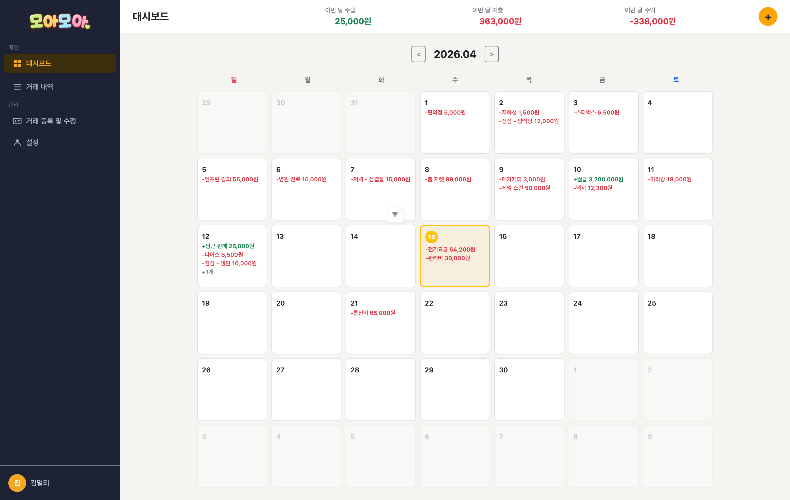
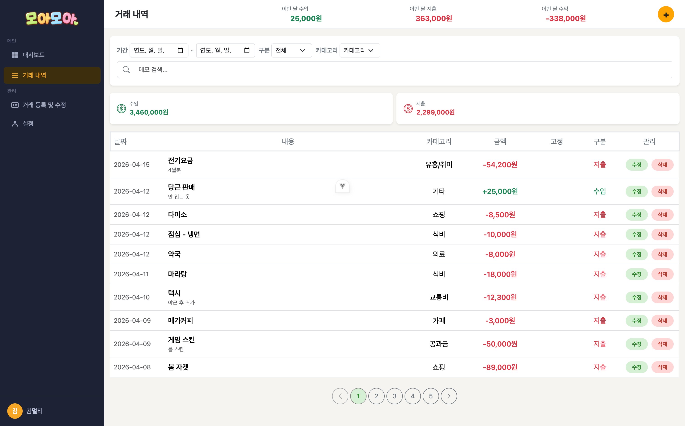
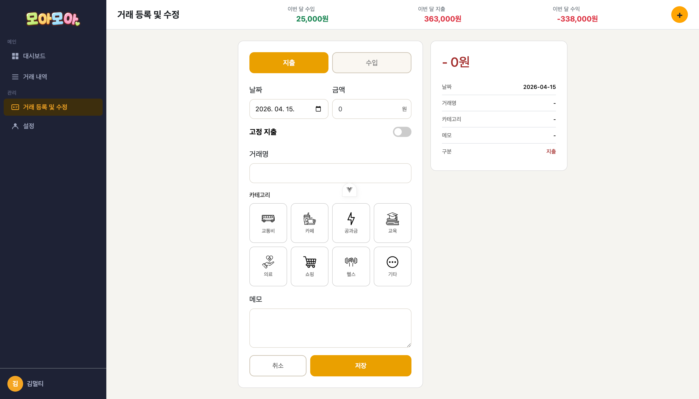
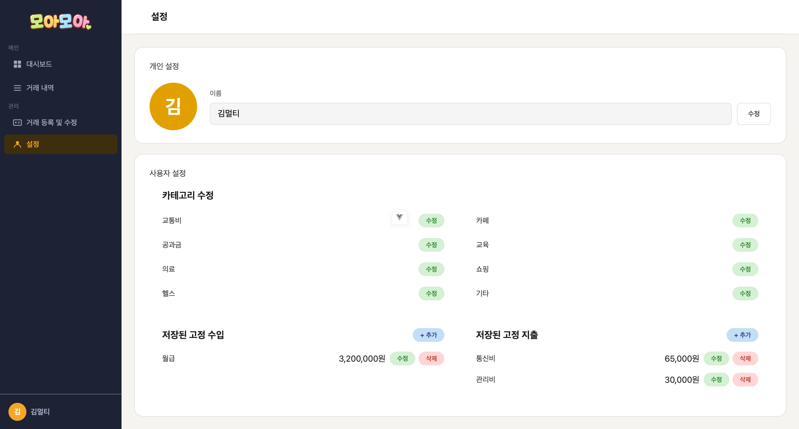

# 💰 모아모아 - 가계부 웹 애플리케이션

> KB IT's Your life 7기 29회차 5팀

---

## 📌 프로젝트 소개

**모아모아**는 Vue.js 3 기반의 개인 가계부 웹 애플리케이션입니다.  
수입과 지출을 손쉽게 기록하고, 캘린더와 필터를 통해 소비 패턴을 직관적으로 파악할 수 있습니다.  
고정 지출 자동 반복, 카테고리 관리, 실시간 미리보기 등 실용적인 기능을 제공합니다.

---

## 👥 팀 소개

| 이름 | 역할 |
|------|------|
| 안상우 | 팀장 / 거래 내역 |
| 강두형 | 프로필 관리 및 환경설정 |
| 이성우 | 거래 등록 및 수정 |
| 조태석 | 메인 캘린더 |

---

## 🛠 기술 스택

| 분류 | 기술 |
|------|------|
| Frontend | Vue.js 3.5.30 |
| Routing | Vue Router 5.0.3 |
| 상태관리 | Pinia 3.0.4 |
| UI / Style | Bootstrap 5.3.8, Bootstrap Icons 1.13.1 |
| HTTP 통신 | Axios 1.14.0 |
| Build Tool | Vite 7.3.1 |
| Runtime | Node.js 20.19.0 이상 |
| 백엔드 | JSON Server (REST API) |

---

## 🗂 프로젝트 구조

```
src/
├── App.vue
├── assets/
│   └── transactioncss/
│       └── transactions.css
├── components/
│   ├── Setting/
│   │   ├── CategoryList.vue       # 카테고리 관리
│   │   ├── FixedList.vue          # 고정 수입/지출 관리
│   │   └── Profile.vue            # 프로필 관리
│   ├── history/
│   │   ├── HistoryFilter.vue      # 거래 내역 필터링
│   │   ├── HistoryTable.vue       # 거래 내역 테이블
│   │   └── Pagination.vue         # 페이지네이션
│   ├── layout/
│   │   ├── Header.vue
│   │   ├── Sidebar.vue
│   │   └── TopBar.vue
│   └── transactions/
│       ├── CategoryGrid.vue       # 카테고리 4열 그리드
│       ├── TransactionForm.vue    # 거래 등록/수정 폼
│       └── TransactionPreview.vue # 실시간 미리보기
├── main.js
├── pages/
│   ├── Home.vue                   # 메인 캘린더 대시보드
│   ├── HistoryPage.vue            # 거래 내역 페이지
│   ├── Transactions.vue           # 거래 등록 페이지
│   └── setting.vue                # 설정 페이지
├── router/
│   └── index.js
└── stores/
    └── user.js
```

---

## ✨ 주요 기능

### 📅 메인 캘린더
- 월별 네비게이션
- 날짜별 수입/지출 표시 (최대 3개, 초과 시 +N개)
- 고정 거래 자동 반복 표시
- 오늘 날짜 강조
- 날짜 클릭 → 날짜에 맞는 거래 내역 페이지 이동

### 📋 거래 내역
- 기간, 구분(수입/지출), 카테고리, 메모로 필터링
- 필터 기준 내 수입/지출 총액 표시
- 내역 수정 및 삭제
- 페이지당 10개 항목, 페이지 번호 5개 표시 / 좌우 이동 가능

### ✏️ 거래 등록 및 수정
- 수입/지출 구분, 날짜, 금액, 거래명, 카테고리, 메모 입력
- 수정 시 기존 데이터 자동 폼 불러오기
- 지출 모드일 때만 카테고리 그리드 표시
- 실시간 미리보기 (금액, 거래명, 카테고리, 구분 즉시 반영)
- 고정 수입/지출 토글 설정
- 저장 후 거래 내역으로 이동 / 취소 시 이전 페이지로 이동

### ⚙️ 프로필 관리 및 환경설정
- 사용자 이름 수정 (사이드바 실시간 동기화)
- 카테고리 관리 (8개 카테고리, 각 항목 수정 가능)
- 고정 수입/지출 관리 (추가/수정/삭제)

---

## 🚀 실행 방법

```bash
# 패키지 설치
npm install

# JSON Server 실행 (별도 터미널)
npx json-server --watch db.json --port 3000

# 개발 서버 실행
npm run dev
```

> Node.js 20.19.0 이상 필요

---

## 🗃 데이터 구조 (db.json)

```json
{
  "users": [],
  "transactions": [],
  "categories": []
}
```

---

## 📐 아키텍처

```
프론트엔드 (Vue 3)
  └── vue-router → Pages → Components
        └── Axios (HTTP 요청/응답)
              ↕
         JSON Server (REST API)
              └── db.json
                    ├── /users
                    ├── /transactions
                    └── /categories
```

---

## 📸 화면 스크린샷

### 메인 캘린더


### 거래 내역


### 거래 등록


### 설정


---

## 💬 회고

> 1주일이라는 짧은 기간 동안 기획부터 구현까지 경험하며,  
> 기능 구현보다 디자인이 어려웠고, 사용자 입장에서 생각하는 것의 중요성을 깨달았습니다.  
> 컴포넌트 설계, Git 브랜치 관리 등 팀 협업이 개발에서 얼마나 중요한지 체감할 수 있었습니다.

---

<div align="center">
  <b>KB IT's Your life 7기 29회차 5팀</b><br/>
  안상우 · 강두형 · 이성우 · 조태석
</div>
